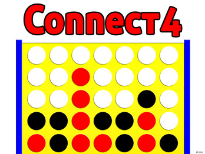

# Connect Four AI
## Patrick Phillips

#### Summary 
In this project I create connect-4 AI players using a minimax tree search algorithm with alpha-beta pruning and other added heuristics (e.g. favoring the middle, and favoring having rows of 2, 3). There are different settings for the AI player that can be used, and the AI player can play on different sized boards. The project uses a simple text interface. First select which board you want to play on, and then select which opponent you want to face. Good luck!

